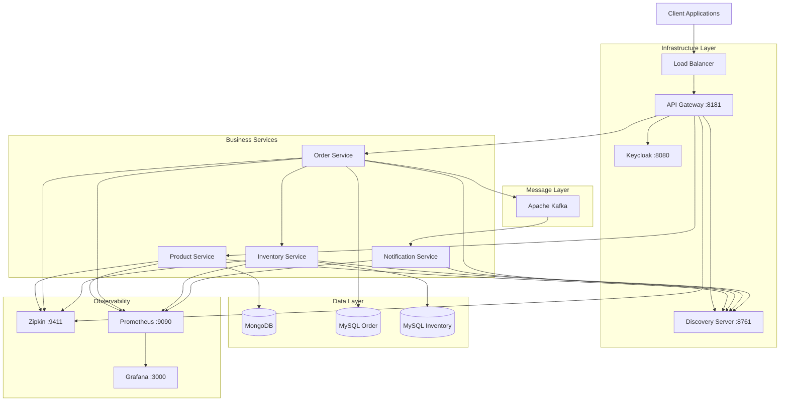
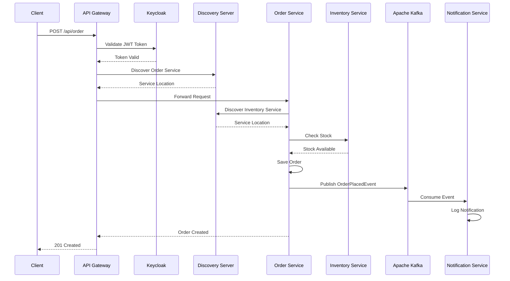

# Architecture Documentation: Micro Marketplace E-commerce Microservices

## Table of Contents
1. [System Architecture](#1-system-architecture)
2. [Module Documentation](#2-module-documentation)
3. [Pipeline Architecture](#3-pipeline-architecture)
4. [Data Models](#4-data-models)
5. [API Documentation](#5-api-documentation)
6. [Configuration Management](#6-configuration-management)
7. [Deployment Architecture](#7-deployment-architecture)
8. [Security](#8-security)
9. [Monitoring and Observability](#9-monitoring-and-observability)
10. [Troubleshooting](#10-troubleshooting)
11. [Future Improvements](#11-future-improvements)

---

## 1. System Architecture

### 1.1 High-Level Architecture



### 1.2 Component Diagram

The system follows a **microservices architecture** with the following layers:

**Presentation Layer**: Client applications (Web, Mobile, API consumers)
**Gateway Layer**: API Gateway with routing, security, and load balancing
**Service Layer**: Business microservices with domain-specific responsibilities
**Data Layer**: Polyglot persistence with MongoDB and MySQL
**Messaging Layer**: Apache Kafka for event-driven communication
**Discovery Layer**: Eureka for service registration and discovery
**Security Layer**: Keycloak for OAuth 2.0 authentication and authorization
**Observability Layer**: Zipkin, Prometheus, and Grafana for monitoring

### 1.3 Data Flow



---

## 2. Module Documentation

### 2.1 Product Service

#### Overview
Product Service manages the complete product catalog for the e-commerce platform, providing CRUD operations for product management.

#### Location
`/product-service`

#### Purpose
- Product catalog management
- Product information storage and retrieval
- RESTful API for product operations
- MongoDB integration for flexible document storage

#### Dependencies
```xml
<dependencies>
    <dependency>
        <groupId>org.springframework.boot</groupId>
        <artifactId>spring-boot-starter-data-mongodb</artifactId>
    </dependency>
    <dependency>
        <groupId>org.springframework.boot</groupId>
        <artifactId>spring-boot-starter-web</artifactId>
    </dependency>
    <dependency>
        <groupId>org.springframework.cloud</groupId>
        <artifactId>spring-cloud-starter-netflix-eureka-client</artifactId>
    </dependency>
    <dependency>
        <groupId>org.springframework.boot</groupId>
        <artifactId>spring-boot-starter-actuator</artifactId>
    </dependency>
    <dependency>
        <groupId>io.micrometer</groupId>
        <artifactId>micrometer-tracing-bridge-brave</artifactId>
    </dependency>
    <dependency>
        <groupId>io.zipkin.reporter2</groupId>
        <artifactId>zipkin-reporter-brave</artifactId>
    </dependency>
    <dependency>
        <groupId>io.micrometer</groupId>
        <artifactId>micrometer-registry-prometheus</artifactId>
    </dependency>
</dependencies>
```

#### Main Components

##### Class: ProductController
**Purpose**: REST API endpoints for product management
**Methods**:
- `createProduct(@RequestBody ProductRequest)`: Creates new product
- `getAllProducts()`: Retrieves all products

##### Class: ProductService
**Purpose**: Business logic for product operations
**Methods**:
- `createProduct(ProductRequest)`: Product creation logic
- `getAllProducts()`: Product retrieval logic
- `mapToProductResponse(Product)`: DTO mapping

##### Class: Product (Entity)
**Purpose**: Product domain model
**Fields**:
- `String id`: Unique identifier
- `String name`: Product name
- `String description`: Product description
- `BigDecimal price`: Product price

#### Configuration
```properties
# Application Configuration
spring.application.name=product-service
server.port=0
spring.data.mongodb.uri=mongodb://localhost:27017/product-service
eureka.client.serviceUrl.defaultZone=http://localhost:8761/eureka/

# Observability
management.zipkin.tracing.endpoint=http://localhost:9411/api/v2/spans
management.tracing.sampling.probability=1.0
management.endpoints.web.exposure.include=prometheus
```

#### API Endpoints
- **POST /api/product**: Create new product
  - Content-Type: application/json
  - Body: `{"name": "string", "description": "string", "price": number}`
  - Response: 201 Created

- **GET /api/product**: Get all products
  - Response: 200 OK with array of products

#### Database Schema
```javascript
// MongoDB Document Structure
{
  "_id": ObjectId,
  "name": String,
  "description": String,
  "price": NumberDecimal
}
```

#### Error Handling
- Standard Spring Boot error handling
- Global exception handler for consistent error responses
- Validation errors return 400 Bad Request

#### Testing
- **Unit tests**: `ProductServiceApplicationTests.java`
- **Integration tests**: Uses TestContainers with MongoDB
- **Coverage**: Controller and Service layer testing

---

### 2.2 Order Service

#### Overview
Order Service handles order processing, inventory validation, and order lifecycle management with circuit breaker patterns for resilience.

#### Location
`/order-service`

#### Purpose
- Order creation and management
- Inventory service integration
- Event publishing for order notifications
- Circuit breaker implementation for fault tolerance

#### Dependencies
```xml
<dependencies>
    <dependency>
        <groupId>org.springframework.boot</groupId>
        <artifactId>spring-boot-starter-data-jpa</artifactId>
    </dependency>
    <dependency>
        <groupId>org.springframework.boot</groupId>
        <artifactId>spring-boot-starter-web</artifactId>
    </dependency>
    <dependency>
        <groupId>org.springframework.cloud</groupId>
        <artifactId>spring-cloud-starter-netflix-eureka-client</artifactId>
    </dependency>
    <dependency>
        <groupId>org.springframework.boot</groupId>
        <artifactId>spring-boot-starter-webflux</artifactId>
    </dependency>
    <dependency>
        <groupId>org.springframework.cloud</groupId>
        <artifactId>spring-cloud-starter-circuitbreaker-resilience4j</artifactId>
    </dependency>
    <dependency>
        <groupId>org.springframework.kafka</groupId>
        <artifactId>spring-kafka</artifactId>
    </dependency>
    <dependency>
        <groupId>mysql</groupId>
        <artifactId>mysql-connector-java</artifactId>
    </dependency>
</dependencies>
```

#### Main Components

##### Class: OrderController
**Purpose**: REST API endpoints for order management
**Methods**:
- `placeOrder(@RequestBody OrderRequest)`: Places new order with circuit breaker
- `fallbackMethod(OrderRequest, RuntimeException)`: Fallback for circuit breaker

##### Class: OrderService
**Purpose**: Business logic for order processing
**Methods**:
- `placeOrder(OrderRequest)`: Order creation with inventory check
- `mapToDto(OrderLineItemsDto)`: DTO mapping

##### Class: WebClientConfig
**Purpose**: Load-balanced WebClient configuration
**Methods**:
- `webClientBuilder()`: Load-balanced WebClient bean

#### Configuration
```properties
# Application Configuration
spring.application.name=order-service
server.port=8081
spring.datasource.url=jdbc:mysql://localhost:3306/order_service?createDatabaseIfNotExist=true
spring.datasource.username=root
spring.datasource.password=mysql
spring.jpa.hibernate.ddl-auto=update

# Circuit Breaker Configuration
resilience4j.circuitbreaker.instances.inventory.registerHealthIndicator=true
resilience4j.circuitbreaker.instances.inventory.slidingWindowSize=5
resilience4j.circuitbreaker.instances.inventory.failureRateThreshold=50
resilience4j.circuitbreaker.instances.inventory.waitDurationInOpenState=5s

# Kafka Configuration
spring.kafka.bootstrap-servers=localhost:9092
spring.kafka.template.default-topic=notificationTopic
spring.kafka.producer.key-serializer=org.apache.kafka.common.serialization.StringSerializer
spring.kafka.producer.value-serializer=org.springframework.kafka.support.serializer.JsonSerializer
```

#### API Endpoints
- **POST /api/order**: Place new order
  - Content-Type: application/json
  - Body: `{"orderLineItemsDtoList": [{"skuCode": "string", "price": number, "quantity": number}]}`
  - Response: 201 Created or Circuit Breaker fallback

#### Database Schema
```sql
CREATE TABLE t_orders (
    id BIGINT AUTO_INCREMENT PRIMARY KEY,
    order_number VARCHAR(255) NOT NULL
);

CREATE TABLE order_line_items (
    id BIGINT AUTO_INCREMENT PRIMARY KEY,
    sku_code VARCHAR(255) NOT NULL,
    price DECIMAL(19,2) NOT NULL,
    quantity INTEGER NOT NULL,
    order_id BIGINT,
    FOREIGN KEY (order_id) REFERENCES t_orders(id)
);
```

#### Error Handling
- Circuit breaker fallback for inventory service failures
- Timeout handling with Resilience4j
- Retry mechanisms for transient failures
- Transaction rollback on failures

#### Testing
- **Unit tests**: `OrderServiceApplicationTests.java`
- **Integration tests**: Database integration testing
- **Circuit breaker tests**: Resilience4j configuration testing

---

### 2.3 Inventory Service

#### Overview
Inventory Service manages product stock levels and provides inventory checking capabilities for other services.

#### Location
`/inventory-service`

#### Purpose
- Stock level management
- Inventory availability checking
- Real-time stock updates
- Database persistence with MySQL

#### Dependencies
```xml
<dependencies>
    <dependency>
        <groupId>org.springframework.boot</groupId>
        <artifactId>spring-boot-starter-data-jpa</artifactId>
    </dependency>
    <dependency>
        <groupId>org.springframework.boot</groupId>
        <artifactId>spring-boot-starter-web</artifactId>
    </dependency>
    <dependency>
        <groupId>org.springframework.cloud</groupId>
        <artifactId>spring-cloud-starter-netflix-eureka-client</artifactId>
    </dependency>
    <dependency>
        <groupId>mysql</groupId>
        <artifactId>mysql-connector-java</artifactId>
    </dependency>
</dependencies>
```

#### Main Components

##### Class: InventoryController
**Purpose**: REST API endpoints for inventory operations
**Methods**:
- `isInStock(@RequestParam List<String> skuCode)`: Check stock availability

##### Class: InventoryService
**Purpose**: Business logic for inventory management
**Methods**:
- `isInStock(List<String> skuCode)`: Stock availability logic

##### Class: Inventory (Entity)
**Purpose**: Inventory domain model
**Fields**:
- `Long id`: Unique identifier
- `String skuCode`: Product SKU
- `Integer quantity`: Available quantity

#### Configuration
```properties
# Application Configuration
spring.application.name=inventory-service
server.port=8082
spring.datasource.url=jdbc:mysql://localhost:3306/inventory_service?createDatabaseIfNotExist=true
spring.datasource.username=root
spring.datasource.password=mysql
spring.jpa.hibernate.ddl-auto=update
```

#### API Endpoints
- **GET /api/inventory**: Check stock availability
  - Query Params: `skuCode` (multiple values supported)
  - Example: `/api/inventory?skuCode=iphone_15&skuCode=iphone_15_pro`
  - Response: Array of `{"skuCode": "string", "isInStock": boolean}`

#### Database Schema
```sql
CREATE TABLE inventory (
    id BIGINT AUTO_INCREMENT PRIMARY KEY,
    sku_code VARCHAR(255) NOT NULL UNIQUE,
    quantity INTEGER NOT NULL DEFAULT 0
);

-- Sample Data
INSERT INTO inventory (sku_code, quantity) VALUES 
('iphone_15', 100),
('iphone_15_pro', 0);
```

#### Error Handling
- Standard Spring Boot error handling
- Database connection error handling
- Invalid SKU code handling

#### Testing
- **Unit tests**: `InventoryServiceApplicationTests.java`
- **Integration tests**: Database integration testing

---

### 2.4 Notification Service

#### Overview
Notification Service is a stateless service that consumes order events from Kafka and handles notification processing.

#### Location
`/notification-service`

#### Purpose
- Event-driven notification processing
- Kafka message consumption
- Order notification handling
- Stateless design for scalability

#### Dependencies
```xml
<dependencies>
    <dependency>
        <groupId>org.springframework.boot</groupId>
        <artifactId>spring-boot-starter-web</artifactId>
    </dependency>
    <dependency>
        <groupId>org.springframework.kafka</groupId>
        <artifactId>spring-kafka</artifactId>
    </dependency>
    <dependency>
        <groupId>org.springframework.cloud</groupId>
        <artifactId>spring-cloud-starter-netflix-eureka-client</artifactId>
    </dependency>
</dependencies>
```

#### Main Components

##### Class: NotificationServiceApplication
**Purpose**: Main application class with Kafka listener
**Methods**:
- `handleNotification(OrderPlacedEvent)`: Kafka message consumer

##### Class: OrderPlacedEvent
**Purpose**: Event model for order notifications
**Fields**:
- `String orderNumber`: Order identifier

#### Configuration
```properties
# Application Configuration
spring.application.name=notification-service
server.port=8083
eureka.client.serviceUrl.defaultZone=http://localhost:8761/eureka

# Kafka Configuration
spring.kafka.bootstrap-servers=localhost:9092
spring.kafka.consumer.group-id=notificationId
spring.kafka.consumer.key-deserializer=org.apache.kafka.common.serialization.StringDeserializer
spring.kafka.consumer.value-deserializer=org.springframework.kafka.support.serializer.JsonDeserializer
```

#### Event Handling
- **Topic**: `notificationTopic`
- **Consumer Group**: `notificationId`
- **Event Type**: `OrderPlacedEvent`
- **Processing**: Logs notification and can be extended for email/SMS

#### Error Handling
- Kafka consumer error handling
- Dead letter queue support (configurable)
- Retry mechanisms for failed notifications

#### Testing
- **Unit tests**: `NotificationServiceApplicationTests.java`
- **Integration tests**: Kafka integration testing

---

### 2.5 API Gateway

#### Overview
API Gateway serves as the unified entry point for all client requests, providing routing, security, and cross-cutting concerns.

#### Location
`/api-gateway`

#### Purpose
- Request routing to microservices
- OAuth 2.0 resource server
- Load balancing with Eureka integration
- Cross-cutting concerns (CORS, rate limiting)

#### Dependencies
```xml
<dependencies>
    <dependency>
        <groupId>org.springframework.cloud</groupId>
        <artifactId>spring-cloud-starter-gateway</artifactId>
    </dependency>
    <dependency>
        <groupId>org.springframework.cloud</groupId>
        <artifactId>spring-cloud-starter-netflix-eureka-client</artifactId>
    </dependency>
    <dependency>
        <groupId>org.springframework.boot</groupId>
        <artifactId>spring-boot-starter-oauth2-resource-server</artifactId>
    </dependency>
</dependencies>
```

#### Main Components

##### Class: SecurityConfig
**Purpose**: Security configuration for OAuth 2.0
**Methods**:
- `springSecurityFilterChain()`: Security filter chain configuration

#### Configuration
```properties
# Application Configuration
spring.application.name=api-gateway
server.port=8181
eureka.client.serviceUrl.defaultZone=http://localhost:8761/eureka

# Route Configuration
spring.cloud.gateway.routes[0].id=product-service
spring.cloud.gateway.routes[0].uri=lb://product-service
spring.cloud.gateway.routes[0].predicates[0]=Path=/api/product

spring.cloud.gateway.routes[1].id=order-service
spring.cloud.gateway.routes[1].uri=lb://order-service
spring.cloud.gateway.routes[1].predicates[0]=Path=/api/order

# Security Configuration
spring.security.oauth2.resourceserver.jwt.issuer-uri=http://localhost:8181/realms/spring-boot-microservices-realm
```

#### Route Configuration
- **Product Service**: `/api/product` → `lb://product-service`
- **Order Service**: `/api/order` → `lb://order-service`
- **Discovery Server**: `/eureka/**` → `http://localhost:8761`

#### Security Implementation
- OAuth 2.0 Resource Server with JWT
- Keycloak integration for token validation
- Path-based security rules
- CSRF protection disabled for APIs

---

### 2.6 Discovery Server

#### Overview
Discovery Server (Eureka Server) provides service registration and discovery capabilities for the microservices ecosystem.

#### Location
`/discovery-server`

#### Purpose
- Service registration and discovery
- Health monitoring of registered services
- Load balancing support
- Service metadata management

#### Dependencies
```xml
<dependencies>
    <dependency>
        <groupId>org.springframework.cloud</groupId>
        <artifactId>spring-cloud-starter-netflix-eureka-server</artifactId>
    </dependency>
    <dependency>
        <groupId>org.springframework.boot</groupId>
        <artifactId>spring-boot-starter-security</artifactId>
    </dependency>
</dependencies>
```

#### Main Components

##### Class: DiscoveryServerApplication
**Purpose**: Eureka Server application
**Annotations**: `@EnableEurekaServer`

##### Class: SecurityConfig
**Purpose**: Security configuration for Eureka endpoints

#### Configuration
```properties
# Application Configuration
spring.application.name=discovery-server
server.port=8761
eureka.instance.hostname=localhost
eureka.client.register-with-eureka=false
eureka.client.fetch-registry=false
```

#### Service Registration
All microservices register with Discovery Server:
- Product Service
- Order Service  
- Inventory Service
- Notification Service
- API Gateway

---

## 3. Pipeline Architecture

### 3.1 Pipeline Overview

The deployment pipeline uses Docker Compose for container orchestration with multi-stage builds and dependency management.

### 3.2 Stage 1: Build Stage

#### Trigger
- Code changes in any service module
- Manual deployment trigger

#### Steps
1. Maven dependency resolution
2. Java compilation (Java 17)
3. Unit test execution
4. Jib Docker image creation
5. Image tagging and registry push

#### Scripts
```bash
# Maven build
mvn clean compile

# Docker build with Jib
mvn compile jib:dockerBuild

# Multi-module build
mvn clean compile -pl product-service,order-service,inventory-service,notification-service,api-gateway,discovery-server
```

#### Artifacts
- Docker images for each service
- Maven build artifacts
- Test reports

#### Success Criteria
- All tests pass
- Docker images successfully built
- No compilation errors

#### Failure Handling
- Build failure notifications
- Artifact cleanup
- Rollback to previous stable images

### 3.3 Stage 2: Infrastructure Stage

#### Trigger
- Successful build stage completion

#### Steps
1. Database container startup (MySQL, MongoDB)
2. Message broker startup (Kafka, Zookeeper)
3. Security service startup (Keycloak)
4. Monitoring services startup (Prometheus, Grafana, Zipkin)

#### Scripts
```bash
# Infrastructure startup
docker-compose up -d mysql-order mysql-inventory mongo keycloak-mysql keycloak zookeeper broker zipkin prometheus grafana
```

#### Artifacts
- Running infrastructure containers
- Database schemas
- Keycloak realm configuration

#### Success Criteria
- All infrastructure services healthy
- Database connections established
- Keycloak realm imported

### 3.4 Stage 3: Service Deployment Stage

#### Trigger
- Successful infrastructure stage

#### Steps
1. Discovery Server deployment
2. API Gateway deployment
3. Business services deployment (Product, Order, Inventory, Notification)
4. Service registration verification
5. Health check validation

#### Scripts
```bash
# Service deployment
docker-compose up -d discovery-server
docker-compose up -d api-gateway
docker-compose up -d product-service order-service inventory-service notification-service
```

#### Artifacts
- Running microservices
- Service registration in Eureka
- Health check endpoints

#### Success Criteria
- All services registered with Eureka
- Health checks passing
- API Gateway routing functional

### 3.5 Stage 4: Verification Stage

#### Trigger
- Successful service deployment

#### Steps
1. Service discovery verification
2. API endpoint testing
3. Circuit breaker testing
4. Event flow testing (Kafka)
5. Monitoring dashboard validation

#### Scripts
```bash
# Health checks
curl http://localhost:8181/actuator/health
curl http://localhost:8761/

# API testing
curl -X GET http://localhost:8181/api/product
curl -X POST http://localhost:8181/api/order
```

#### Success Criteria
- All API endpoints responding
- Distributed tracing working
- Metrics collection active
- Event flow functional

---

## 4. Data Models

### 4.1 Product Model

```java
@Document(value = "product")
public class Product {
    @Id
    private String id;
    private String name;
    private String description;
    private BigDecimal price;
}
```

**Validation Rules**:
- Name: Required, max 255 characters
- Description: Optional, max 1000 characters  
- Price: Required, positive value

### 4.2 Order Model

```java
@Entity
@Table(name = "t_orders")
public class Order {
    @Id
    @GeneratedValue(strategy = GenerationType.IDENTITY)
    private Long id;
    private String orderNumber;
    @OneToMany(cascade = CascadeType.ALL)
    private List<OrderLineItems> orderLineItemsList;
}

@Entity
public class OrderLineItems {
    @Id
    @GeneratedValue(strategy = GenerationType.IDENTITY)
    private Long id;
    private String skuCode;
    private BigDecimal price;
    private Integer quantity;
}
```

**Relationships**:
- Order → OrderLineItems (One-to-Many)
- Cascade operations for order line items

### 4.3 Inventory Model

```java
@Entity
public class Inventory {
    @Id
    @GeneratedValue(strategy = GenerationType.IDENTITY)
    private Long id;
    private String skuCode;
    private Integer quantity;
}
```

**Business Rules**:
- SKU codes must be unique
- Quantity cannot be negative
- Stock checks are real-time

### 4.4 Event Models

```java
public class OrderPlacedEvent {
    private String orderNumber;
}
```

**Event Characteristics**:
- Immutable event data
- JSON serialization for Kafka
- Event sourcing pattern

---

## 5. API Documentation

### 5.1 Authentication

**Type**: OAuth 2.0 with JWT tokens  
**Provider**: Keycloak  
**Grant Type**: Client Credentials  

**Token Endpoint**: 
```
POST http://keycloak:8080/realms/spring-boot-microservices-realm/protocol/openid-connect/token

Content-Type: application/x-www-form-urlencoded

grant_type=client_credentials
client_id=spring-cloud-client
client_secret=<client-secret>
```

### 5.2 Product API

#### POST /api/product
**Description**: Create a new product
**Request**:
```json
{
  "name": "iPhone 15",
  "description": "Apple iPhone 15",
  "price": 1500
}
```
**Response**: `201 Created`

#### GET /api/product
**Description**: Get all products
**Response**: 
```json
[
  {
    "id": "product-id",
    "name": "iPhone 15",
    "description": "Apple iPhone 15", 
    "price": 1500
  }
]
```

### 5.3 Order API

#### POST /api/order
**Description**: Place a new order
**Request**:
```json
{
  "orderLineItemsDtoList": [
    {
      "skuCode": "iphone_15",
      "price": 1500,
      "quantity": 1
    }
  ]
}
```
**Response**: `201 Created` or Circuit Breaker fallback

### 5.4 Inventory API

#### GET /api/inventory
**Description**: Check stock availability
**Query Parameters**: `skuCode` (multiple values)
**Example**: `/api/inventory?skuCode=iphone_15&skuCode=iphone_15_pro`
**Response**:
```json
[
  {
    "skuCode": "iphone_15",
    "isInStock": true
  },
  {
    "skuCode": "iphone_15_pro", 
    "isInStock": false
  }
]
```

---

## 6. Configuration Management

### 6.1 Environment Variables

**Common Variables**:
```bash
# Service Discovery
EUREKA_CLIENT_SERVICEURL_DEFAULTZONE=http://discovery-server:8761/eureka

# Tracing
MANAGEMENT_ZIPKIN_TRACING_ENDPOINT=http://zipkin:9411/api/v2/spans

# Database
SPRING_DATASOURCE_URL=jdbc:mysql://mysql-order:3306/order_service
SPRING_DATASOURCE_USERNAME=ibatulanand
SPRING_DATASOURCE_PASSWORD=password

# Kafka
SPRING_KAFKA_BOOTSTRAPSERVERS=broker:29092

# Security
SPRING_SECURITY_OAUTH2_RESOURCESERVER_JWT_ISSUERURI=http://keycloak:8080/realms/spring-boot-microservices-realm
```

### 6.2 Configuration Files

**Docker Compose**: `docker-compose.yml`
- Service definitions
- Network configuration
- Volume management
- Environment variables

**Prometheus**: `prometheus/prometheus.yml`
- Scrape configurations
- Service discovery
- Alerting rules

**Keycloak**: `realms/spring-boot-microservices-realm.json`
- Realm configuration
- Client definitions
- User roles and permissions

### 6.3 Secrets Management

**Development**: Environment variables in Docker Compose
**Production Considerations**:
- External secret management (HashiCorp Vault, Kubernetes Secrets)
- JWT signing keys rotation
- Database credentials encryption

---

## 7. Deployment Architecture

### 7.1 Container Orchestration

**Platform**: Docker Compose  
**Networking**: Bridge networking with service names  
**Storage**: Named volumes for data persistence  

**Service Dependencies**:
```yaml
services:
  product-service:
    depends_on:
      - mongo
      - discovery-server
      - zipkin
  
  order-service:
    depends_on:
      - mysql-order
      - discovery-server
      - broker
      - zipkin
```

### 7.2 Scaling Strategy

**Horizontal Scaling**:
- Stateless service design
- Load balancing via Spring Cloud Gateway
- Database connection pooling

**Vertical Scaling**:
- JVM memory configuration
- Container resource limits
- Database performance tuning

### 7.3 Health Checks

**Spring Boot Actuator**: `/actuator/health`
**Custom Health Indicators**:
- Database connectivity
- Kafka connectivity
- Eureka registration status

### 7.4 Service Mesh Considerations

**Current**: Spring Cloud Gateway + Eureka  
**Future**: Istio or Consul Connect integration
- Traffic management
- Security policies
- Observability enhancement

---

## 8. Security

### 8.1 Authentication & Authorization

**OAuth 2.0 Flow**:
1. Client requests token from Keycloak
2. Keycloak validates client credentials
3. JWT token issued with roles/scopes
4. API Gateway validates token on each request
5. Services trust validated requests

**Security Headers**:
- JWT validation
- CORS configuration
- CSRF protection (disabled for APIs)

### 8.2 Data Protection

**In Transit**:
- HTTPS for external communication
- Service-to-service communication over Docker network
- JWT token encryption

**At Rest**:
- Database encryption (configurable)
- Secrets management for sensitive data
- Container image security scanning

### 8.3 Security Best Practices

**Implemented**:
- Principle of least privilege
- Service isolation via containers
- Input validation and sanitization
- Secure defaults configuration

**Recommended Additions**:
- API rate limiting
- Request/response logging
- Security headers (HSTS, CSP)
- Vulnerability scanning

---

## 9. Monitoring and Observability

### 9.1 Distributed Tracing

**Zipkin Integration**:
- Trace ID propagation across services
- Span creation for service calls
- Performance bottleneck identification
- Request flow visualization

### 9.2 Metrics Collection

**Prometheus Scraping**:
- Application metrics (JVM, HTTP, custom)
- Infrastructure metrics (Docker, databases)
- Business metrics (order count, inventory levels)

**Grafana Dashboards**:
- Service health overview
- Performance metrics
- Business KPIs
- Alert visualizations

### 9.3 Logging Strategy

**Structured Logging**:
- JSON format for log aggregation
- Correlation IDs for request tracing
- Log levels: ERROR, WARN, INFO, DEBUG

**Log Aggregation** (Future):
- ELK Stack (Elasticsearch, Logstash, Kibana)
- Centralized log management
- Log-based alerting

### 9.4 Alerting

**Prometheus Alerting** (Configurable):
- Service unavailability
- High error rates
- Performance degradation
- Resource exhaustion

**Notification Channels**:
- Email notifications
- Slack integration
- PagerDuty for critical alerts

---

## 10. Troubleshooting

### 10.1 Common Issues

**Service Discovery Problems**:
```bash
# Check Eureka registration
curl http://localhost:8761/eureka/apps

# Check service health
docker logs discovery-server
```

**Database Connection Issues**:
```bash
# Check database container
docker logs mysql-order
docker logs mongo

# Verify connectivity
docker exec -it order-service ping mysql-order
```

**Circuit Breaker Activation**:
```bash
# Check circuit breaker metrics
curl http://localhost:8181/actuator/health

# Monitor inventory service health
curl http://localhost:8082/actuator/health
```

**Kafka Message Issues**:
```bash
# Check Kafka logs
docker logs broker

# Verify topic creation
docker exec -it broker kafka-topics --list --bootstrap-server localhost:9092
```

### 10.2 Debug Guide

**Enable Debug Logging**:
```properties
logging.level.org.springframework.cloud.gateway=DEBUG
logging.level.com.ibatulanand=DEBUG
```

**Trace Request Flow**:
1. Check API Gateway logs for request routing
2. Verify service discovery in Eureka
3. Check target service logs
4. Review Zipkin traces for performance
5. Monitor Kafka for event flow

**Performance Analysis**:
1. Zipkin for request latency
2. Prometheus for resource utilization
3. Grafana for trend analysis
4. Database query performance

### 10.3 Recovery Procedures

**Service Recovery**:
```bash
# Restart individual service
docker-compose restart product-service

# Full system restart
docker-compose down && docker-compose up -d
```

**Data Recovery**:
- Database backups (implement regular backups)
- Kafka message replay for event recovery
- Configuration restore from version control

---

## 11. Future Improvements

### 11.1 Architecture Enhancements

**Service Mesh Migration**:
- Istio or Linkerd implementation
- Enhanced traffic management
- Advanced security policies
- Better observability

**Event Sourcing**:
- Complete event store implementation
- CQRS pattern adoption
- Event replay capabilities
- Audit trail enhancement

### 11.2 Performance Optimizations

**Caching Strategy**:
- Redis for application caching
- Database query optimization
- CDN for static content
- Cache invalidation patterns

**Database Optimization**:
- Read replicas for scaling
- Database sharding strategies
- Connection pool tuning
- Query performance monitoring

### 11.3 Operational Improvements

**CI/CD Pipeline**:
- Automated testing integration
- Blue-green deployment
- Canary releases
- Infrastructure as Code (Terraform)

**Monitoring Enhancement**:
- Custom business metrics
- Predictive alerting
- SLA monitoring
- Cost optimization tracking

### 11.4 Security Hardening

**Advanced Security**:
- mTLS for service communication
- Service mesh security policies
- Runtime security monitoring
- Compliance automation (SOC 2, PCI DSS)

**Zero Trust Architecture**:
- Identity-based access control
- Network segmentation
- Continuous verification
- Risk-based authentication

This architecture documentation provides a comprehensive view of the Micro Marketplace e-commerce microservices system, enabling effective development, deployment, and maintenance of the platform.
